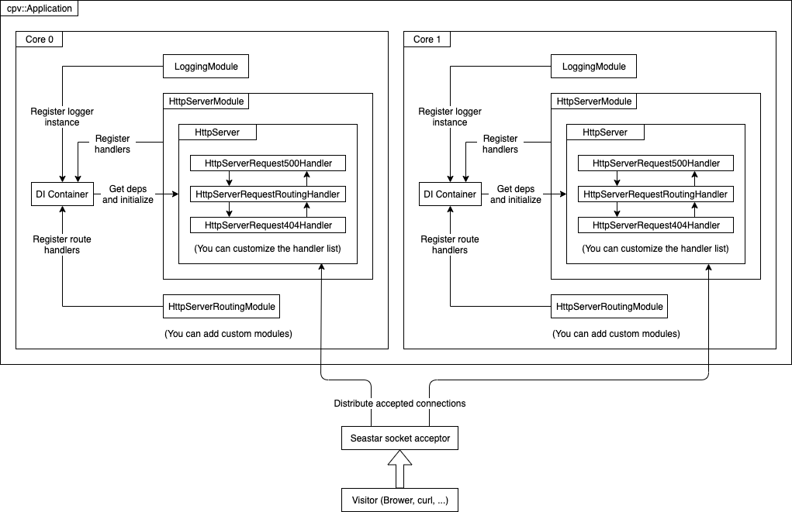

# C++ web framework based on seastar framework

[](https://www.codacy.com/app/compiv/cpv-framework?utm_source=github.com&amp;utm_medium=referral&amp;utm_content=cpv-project/cpv-framework&amp;utm_campaign=Badge_Grade)
[](https://travis-ci.org/cpv-project/cpv-framework)
[]() 
[]()

cpv framework is a web framework written in c++ based on [seastar framework](https://github.com/scylladb/seastar), it focus on high performance and modular design.

seastar framework is a application framework that use the share nothing programming model, which isolate resources explicitly for each cpu core. cpv framework use this model too, a cpv application will initialize services on each cpu core, execute them on each cpu core and avoid sharing data between cpu cores, you don't need thread locks or atomic variables in cpv application because all code will be thread safe by design.

In addition, cpv framework avoid memory copies by using `std::string_view` and scattered message (struct iovec) everywhere, you can get a string view of url path, query parameter, http header, and body content of request inside the original packet (there few cases require copy such as http header value splited in two packets, or encoded query parameter different from original), and you can construct a scattered message as http response body by using `cpv::Packet` (which uses struct iovec for multiple segments).

For more features, see the feature list and documents below.

## Features

- Isolate resources explicitly between cpu cores
- Avoid memory copies by using `std::string_view` and scattered messages everywhere
- Future promise based asynchronous interface
- Dependency injection container
- Modular design
	- Modules decide what to do when application start and stop
	- Modules register services to dependency injection container and retrive services from it
- Http server
	- Supports Http 1.0/1.1 (use [http-parser](https://github.com/nodejs/http-parser))
	- Supports pipeline
	- Supports chained multiple request handlers (middleware style)
	- Supports full and wildcard url routing (by using routing handler)
	- Provide stream interface for request body and response body

You can also check the [roadmap](./docs/Roadmap.md) to see which features will be added in the next release.

## Getting Started

### Install cpv framework

If you're using ubuntu 18.04, you can install cpv framework from PPA, this is the easiest way:

``` sh
sudo apt-get install software-properties-common
sudo add-apt-repository ppa:compiv/cpv-project
sudo apt-get update
sudo apt-get install cpvframework
```

In addition, you need gcc-9 to compile cpv application.

``` sh
sudo add-apt-repository -y ppa:ubuntu-toolchain-r/test
sudo apt-get install g++-9
```

If you're using other linux distribution, you can install from source:

``` sh
# please ensure seastar framework is installed
# please ensure `pkg-config --cflags seastar` works
# please ensure `pkg-config --libs seastar` works

mkdir -p build/cpvframework-custom
cd build/cpvframework-custom
cmake -DCMAKE_BUILD_TYPE=RelWithDebInfo \
	-DCMAKE_C_COMPILER=gcc-9 \
	-DCMAKE_CXX_COMPILER=g++-9 \
	../../src
make V=1
make install V=1
```

If you're using windows or macosx, you can use docker with ubuntu 18.04 image because seastar framework is basiclly linux only.

### Write a hello world application

This is the source code of a hello world cpv application, it's same as `examples/HelloWorld/Main.cpp`:

``` c++
#include <seastar/core/app-template.hh>
#include <CPVFramework/Application/Application.hpp>
#include <CPVFramework/Application/Modules/LoggingModule.hpp>
#include <CPVFramework/Application/Modules/HttpServerModule.hpp>
#include <CPVFramework/Application/Modules/HttpServerRoutingModule.hpp>
#include <CPVFramework/Http/HttpResponseExtensions.hpp>

int main(int argc, char** argv) {
	seastar::app_template app;
	app.run(argc, argv, [] {
		cpv::Application application;
		application.add<cpv::LoggingModule>();
		application.add<cpv::HttpServerModule>([] (auto& module) {
			module.getConfig().setListenAddresses({ "0.0.0.0:8000", "127.0.0.1:8001" });
		});
		application.add<cpv::HttpServerRoutingModule>([] (auto& module) {
			module.route(cpv::constants::GET, "/", [] (cpv::HttpContext& context) {
				return cpv::extensions::reply(context.getResponse(), "Hello World!");
			});
		});
		return application.runForever();
	});
	return 0;
}
```

It creates a cpv application, add 3 modules, route GET "/" to a custom handle function which replies "Hello World!" and run the cpv application on seastar framework forever (until Ctrl+C pressed).

### Compile and execute the hello world application

Now you can compile the hello world application:

``` sh
g++-9 $(pkg-config --cflags seastar) \
	$(pkg-config --cflags cpvframework) \
	hello.cpp \
	$(pkg-config --libs seastar) \
	$(pkg-config --libs cpvframework)
```

And execute it with:

``` sh
# --reactor-backend epoll is recommended because it's stable but not required
./a.out --reactor-backend epoll
```

It will initialize services and handle requests like this graphic describe (assume it used 2 cpu cores):



Finally you can test the application with curl:

``` sh
curl -v http://localhost:8000
```

## Documents

- [Application and modules](./docs/ApplicationAndModules.md)
- [Dependency injection container](./docs/DependencyInjectionContainer.md)
- [Http server request handlers](./docs/HttpServerRequestHandlers.md)

## Examples

- [Hello world](./examples/HelloWorld)

## Running Tests

Please check [tests/travis_run_tests.sh](./tests/travis_run_tests.sh) for how to setup a environment for testing and run the tests.

## Contribution

You should follow these rules when contributing code, pull request or patch is welcome.

- Use tabs instead of spaces
- For class names, use camel case and start with a upper case (e.g. `SomeClass`)
- For function names, use camel case and start with a lower case (e.g. `someFunction`)
- For local variable names, use camel case and start with a lower case (e.g. `someInt`)
- For global variable names, use camel case and start with a upper case (e.g. `SomeGlobalValue`)
- For class member names, use camel case and start with a lower case and ends with `_` (e.g. `someMember_`)
- Write comments for every public class and function, keep the code as simple as possible

## License

LICENSE: MIT LICENSE<br/>
Copyright © 2018-2019 303248153@github<br/>
If you have any license issue please contact 303248153@qq.com.

